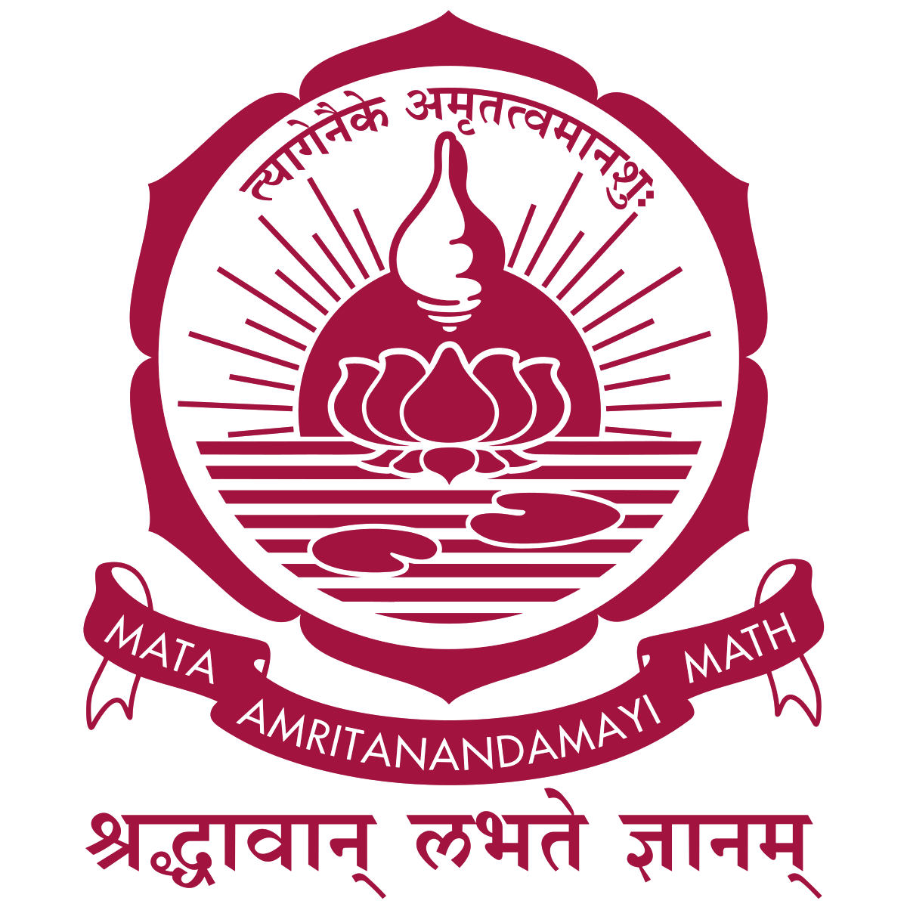

  <table>
    <thead>
        <tr>
            <th>School</th>
            <th>Link</th>
            <th>Degree</th>
            <th>Date</th>
        </tr>
    </thead>
    <tbody>
        <tr>
            <td rowspan=2></td>
            <td rowspan=2><a href="https://purdue.edu/" target="_blank">Purdue University</a></td>
        </tr>
        <tr>
            <td>MS, Computer and Information Technology (Thesis)</td>
            <td>Aug, 2023 - May, 2025</td>
        </tr>
        <tr>
            <td rowspan=2></td>
            <td rowspan=2><a href="https://amrita.edu/" target="_blank">Amrita Vishwa Vidyapeetham</a></td>
        </tr>
        <tr>
            <td>B.Tech, Computer Science and Engineering</td>
            <td>July, 2016 - Aug, 2020</td>
        </tr>
    </tbody>
  </table>

---